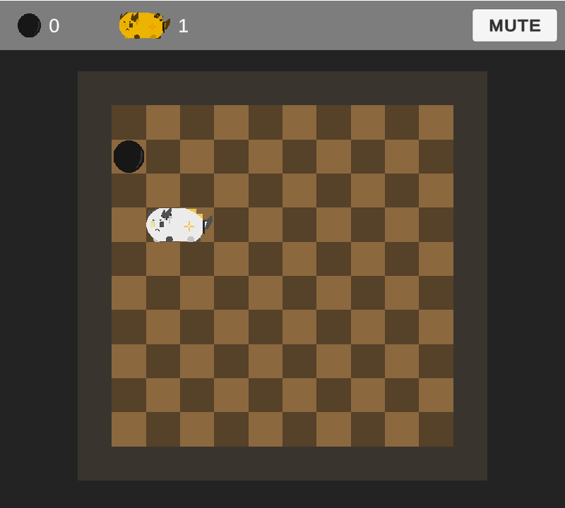
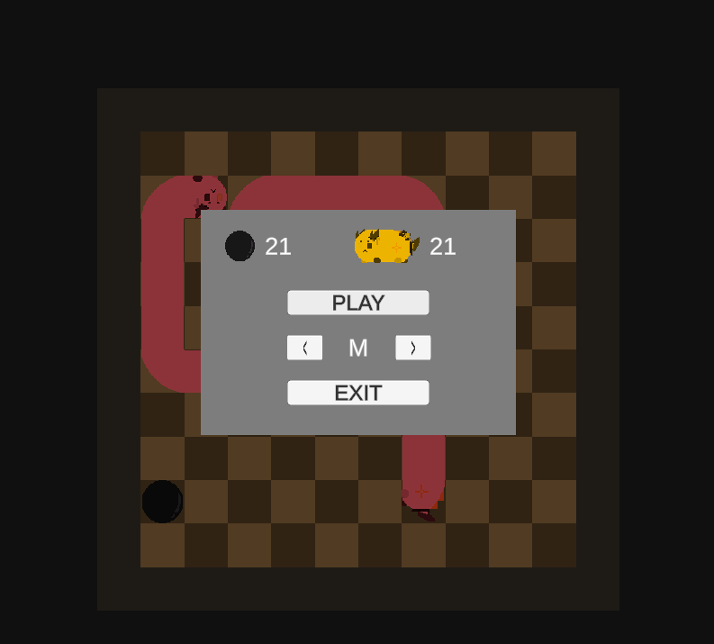

# Snakegame

구글 스네이크 게임의 플레이 방식을 바탕으로, 명일방주 캐릭터를 모티브로 제작한 간단한 2D 팬게임입니다.

Unity를 이용해 제작했으며, Windows 환경에서 플레이할 수 있습니다.

---

## 게임 화면

  
  

---

## 다운로드

게임은 GitHub의 **Releases**에서 다운로드할 수 있습니다.

1. 최신 Release의 ZIP 파일을 다운로드합니다.
2. 원하는 위치에 압축을 해제합니다.
3. `Snakegame.exe`를 실행합니다.

> **주의**
> - ZIP 내부의 파일이나 폴더를 삭제하거나 이동하면 게임이 정상적으로 실행되지 않을 수 있습니다.
> - 코드 서명이 적용되지 않은 프로그램이므로 Windows SmartScreen 경고가 표시될 수 있습니다.

---

## 조작법

| 동작 | 조작 |
| --- | --- |
| 이동 | 방향키 / WASD |

---

## 주요 기능

- 방향키 및 WASD를 이용한 스네이크 이동
- 먹이 획득 및 점수 기록
- 플레이 시간 표시
- 게임 오버 및 재시작
- 효과음 지원

---

## 지원 환경

- Windows 10 / 11
- 64-bit

---

## 개발 환경

- Unity
- C#

---

## Release

현재 공개 버전: **v1.0.0**

실행 파일과 버전별 변경 사항은 GitHub의 **Releases**에서 확인할 수 있습니다.

---

## Disclaimer

본 프로젝트는 개인적으로 제작한 비공식 팬게임입니다.

원작 및 관련 캐릭터의 권리는 각 권리자에게 있으며, 본 프로젝트는 원작 및 관련 권리자와 공식적인 관련이 없습니다.